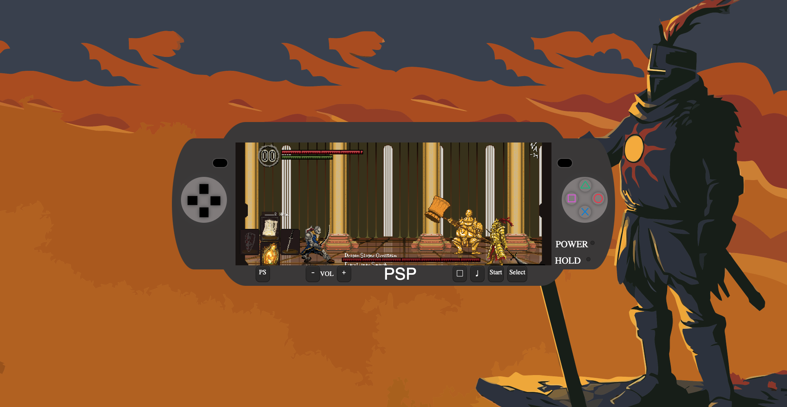

# fsdVAL0923Proyecto2JsDomBom
# PSP Dark Souls Replica

Esta es una aplicación web que replica la interfaz de una consola PSP con una temática inspirada en el juego Dark Souls. Utiliza tecnologías web estándar como HTML5, CSS3 y JavaScript para crear una experiencia interactiva.

## Características

- **Interfaz de PSP**: La aplicación replica la apariencia y funcionalidad básica de una consola PSP, incluyendo la pantalla principal, botones.

- **Temática Dark Souls**: La interfaz de usuario y el diseño están inspirados en el mundo y el estilo visual del juego Dark Souls, creando una experiencia inmersiva.

- **Botones Interactivos**: Los botones en la pantalla son interactivos y responden a eventos de clic, lo que permite una experiencia de usuario.

- **Cambios de Imagen**: Puedes cambiar entre imágenes de fondo relacionadas con Dark Souls haciendo clic en los botones correspondientes.

- **Encender/Apagar**: La aplicación cuenta con un botón de encendido/apagado que controla la interacción del usuario.

## Uso

1. Clona este repositorio o descarga los archivos en tu sistema.

2. Abre el archivo `index.html` en tu navegador web.

3. Explora la réplica de la PSP con temática Dark Souls.

4. Utiliza los botones para cambiar imágenes de fondo y experimentar con la interfaz.

## Contribución

Si deseas contribuir o realizar mejoras en esta aplicación, puedes seguir estos pasos:

1. Haz un fork de este repositorio.

2. Clona el repositorio forked en tu sistema local.

3. Realiza las modificaciones y mejoras necesarias.

4. Crea un pull request para discutir tus cambios y solicitar que se fusionen con la rama principal.

## Créditos

- Este proyecto fue creado por Jose Ángel Cabanes García.

- La temática de Dark Souls es propiedad de From software.

---

¡Disfruta explorando la réplica de la PSP con temática Dark Souls!

